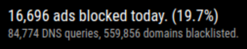

# MMM-pihole-stats

Pi-hole stats module for MagicMirror².

## Screenshots

With `config.showSources` enabled:

")

Without `config.showSources` enabled:



## Dependencies

-   [MagicMirror²](https://github.com/MagicMirrorOrg/MagicMirror)
-   [Pi-hole](https://pi-hole.net)

## Installation

1. Clone this repo into `~/MagicMirror/modules` directory.
   `git clone https://github.com/sheyabernstein/MMM-pihole-stats`
2. Obtain an API token from your PiHole installation by navigating to [http://pi.hole/admin/settings.php?tab=api](http://pi.hole/admin/settings.php?tab=api) and clicking `Show API token`
3. Configure your `~/MagicMirror/config/config.js`

> Feb 28, 2024: The `port` config option has been removed. The `apiURL` should now be an absolute URL, including the port and protocol.

Here is an example entry for `config.js`:

```js
{
    module: "MMM-pihole-stats",
    position: "top_left", // Or any valid MagicMirror position.
    config: {
      apiURL: "http://192.168.0.10/admin/api.php",
      apiToken: "0123456789abcdef",
      // See 'Configuration options' for more information.
    }
},
```

## Configuration Options

| **Option**               | **Default**                    | **Description**                                                                                                                     |
| ------------------------ | ------------------------------ | ----------------------------------------------------------------------------------------------------------------------------------- |
| `apiURL`                 | `http://pi.hole/admin/api.php` | Absolute URL to Pi-hole admin API, including HTTP protocol and port                                                                                       |
| `apiToken`               |                                | Pi-hole API Token (required for `showSources`)                                                                                 |
| `showSources`            | `true`                         | Show request sources (clients)                                                                                                      |
| `sourcesCount`           | `10`                           | Number of returned entries for `showSources`                                                                                        |
| `showSourceHostnameOnly` | `true`                         | Only show hostname if applicable without showing IP address                                                                         |
| `updateInterval`         | `600000`                       | Time in ms to wait until updating                                                                                                   |
| `retryDelay`             | `30000`                        | Time in ms to wait before retry                                                                                                     |
| `floatingPoints`         | `2`                            | Format floating point numbers to decimal points, e.g. `2` to format to 5.55. Setting this to `0` will show unlimited decimal points |
